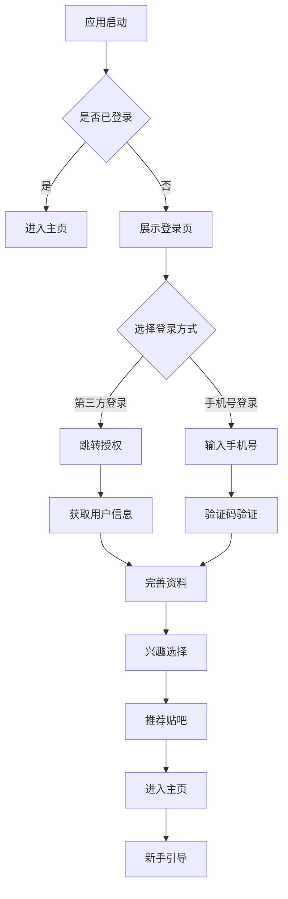
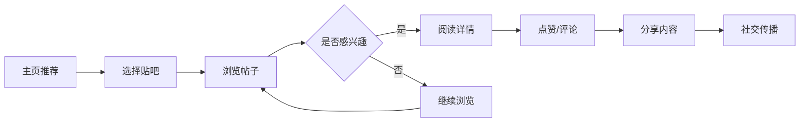

# 百度贴吧产品原型设计与脑图文档

## 1. 产品核心价值主张

### 1.1 产品定位
- **目标用户**：年轻化社交群体，兴趣社区爱好者
- **核心价值**：基于兴趣的垂直社交平台
- **差异化优势**：位置感知 + 兴趣社交 + 第三方服务集成

### 1.2 主要用户群体详细分析

#### 1.2.1 学生群体（18-25岁）
**用户特征：**
- 活跃度高，社交需求强烈
- 对新鲜事物接受度高
- 校园生活丰富，分享欲望强
- 经济能力有限，注重性价比

**核心需求：**
- 校园生活分享和交流
- 兴趣社团和活动组织
- 学习资料和经验分享
- 同城交友和娱乐活动

**功能偏好：**
- 位置签到和附近同学发现
- 校园贴吧和兴趣小组
- 活动组织和参与
- 表情包和趣味互动

#### 1.2.2 职场新人群体（25-35岁）
**用户特征：**
- 工作压力大，寻求放松
- 职业发展需求强烈
- 注重实用性和效率
- 有一定消费能力

**核心需求：**
- 行业交流和经验分享
- 职业技能学习和提升
- 人脉拓展和资源获取
- 生活娱乐和压力释放

**功能偏好：**
- 专业贴吧和行业交流
- 知识分享和学习社区
- 职场人脉和资源对接
- 生活服务和娱乐推荐

#### 1.2.3 兴趣爱好者群体（全年龄段）
**用户特征：**
- 对特定领域有深度兴趣
- 追求专业性和深度交流
- 忠诚度高，参与度强
- 愿意为兴趣投入时间

**核心需求：**
- 专业内容获取和分享
- 同好交流和互动
- 活动参与和组织
- 知识沉淀和传播

**功能偏好：**
- 垂直兴趣贴吧
- 专业内容创作工具
- 活动组织和参与
- 知识库和资源分享

## 2. App实现功能详细规划

### 2.1 核心功能模块

#### 2.1.1 用户系统功能
**注册登录功能：**
- **多方式注册**：手机号、邮箱、第三方账号（微信、QQ、微博）
- **一键登录**：支持运营商免密登录
- **安全验证**：短信验证码、图形验证码、人脸识别
- **账号管理**：密码修改、账号绑定、注销账号

**个人资料管理：**
- **基本信息**：昵称、头像、性别、生日、地区
- **个性化设置**：主题皮肤、字体大小、通知偏好
- **隐私设置**：可见范围、黑名单管理、数据导出
- **社交关系**：关注列表、粉丝管理、好友推荐

#### 2.1.2 贴吧系统功能
**贴吧创建与管理：**
- **贴吧创建**：名称、分类、简介、头像、规则设置
- **吧务管理**：吧主、小吧主、小编权限分配
- **内容管理**：帖子审核、置顶、加精、删除
- **数据统计**：成员数、发帖量、活跃度分析

**贴吧分类与推荐：**
- **分类体系**：兴趣标签、地理位置、热门程度
- **智能推荐**：基于用户行为和兴趣的个性化推荐
- **搜索发现**：关键词搜索、热门贴吧、附近贴吧

#### 2.1.3 内容系统功能
**帖子发布功能：**
- **富媒体支持**：文字、图片、视频、音频、位置
- **实时编辑**：草稿保存、自动保存、版本历史
- **位置集成**：位置签到、地理标签、附近推荐
- **协作功能**：多人编辑、@提及、话题标签

**内容互动功能：**
- **点赞收藏**：点赞、收藏、分享、举报
- **评论系统**：楼中楼回复、表情回复、引用回复
- **内容推荐**：相关帖子、热门内容、个性化推荐

#### 2.1.4 互动系统功能
**即时通讯：**
- **私信聊天**：一对一、群聊、文件传输
- **消息通知**：系统消息、互动提醒、活动通知
- **表情系统**：表情包、动态表情、自定义表情

**社交互动：**
- **@提及功能**：用户提及、贴吧提及、话题提及
- **分享功能**：内容分享、贴吧分享、个人主页分享
- **活动参与**：投票、抽奖、打卡、签到

### 2.2 特色功能模块

#### 2.2.1 位置服务功能
**地图集成：**
- **位置定位**：GPS定位、基站定位、IP定位
- **地图展示**：贴吧分布、用户位置、活动地点
- **路径规划**：导航到贴吧活动地点

**LBS功能：**
- **附近贴吧**：基于距离的贴吧推荐
- **位置签到**：打卡记录、签到排行
- **地理围栏**：进入特定区域自动推送
- **同城活动**：本地活动发现和参与

#### 2.2.2 推送服务功能
**推送类型：**
- **实时消息**：私信、评论、点赞通知
- **系统通知**：活动提醒、系统公告
- **个性化推荐**：基于兴趣的内容推荐
- **营销推送**：优惠活动、新功能通知

**推送策略：**
- **智能时机**：基于用户活跃时间的推送
- **个性化内容**：基于用户偏好的内容定制
- **频率控制**：避免过度打扰的用户设置

#### 2.2.3 社交分享功能
**分享平台：**
- **即时通讯**：微信、QQ、钉钉
- **社交网络**：微博、朋友圈、QQ空间
- **短视频平台**：抖音、快手、B站

**分享内容：**
- **帖子分享**：带预览的帖子链接分享
- **贴吧分享**：贴吧介绍和邀请加入
- **个人主页**：个人成就和内容展示

#### 2.2.4 第三方登录功能
**登录方式：**
- **社交账号**：微信、QQ、微博、Apple ID
- **运营商**：手机号一键登录
- **邮箱登录**：传统邮箱账号登录

**账号管理：**
- **账号绑定**：多账号关联和切换
- **数据同步**：社交关系、头像、昵称同步
- **安全保护**：登录记录、异常提醒

### 2.3 增值服务模块

#### 2.3.1 会员体系功能
**会员特权：**
- **身份标识**：专属头衔、徽章、特效
- **功能特权**：更大存储空间、高级编辑工具
- **内容特权**：专属贴吧、付费内容访问

**成长体系：**
- **等级系统**：经验值、等级、成长任务
- **成就系统**：勋章、成就、排行榜
- **虚拟经济**：积分、金币、虚拟礼物

#### 2.3.2 商业化功能
**广告系统：**
- **原生广告**：信息流广告、贴吧推荐广告
- **品牌合作**：品牌贴吧、品牌活动
- **精准投放**：基于用户画像的广告推荐

**付费功能：**
- **付费贴吧**：专属内容、付费加入
- **虚拟商品**：表情包、主题、虚拟礼物
- **打赏功能**：内容创作者打赏支持

#### 2.3.3 数据分析功能
**用户分析：**
- **行为分析**：使用时长、活跃时段、功能偏好
- **画像分析**：兴趣标签、社交关系、消费能力
- **留存分析**：新用户留存、老用户活跃度

**内容分析：**
- **热度分析**：帖子热度、贴吧活跃度
- **传播分析**：内容传播路径、分享效果
- **趋势分析**：热门话题、流行趋势

### 2.4 管理后台模块

#### 2.4.1 内容管理功能
**审核系统：**
- **自动审核**：AI内容识别、敏感词过滤
- **人工审核**：审核队列、审核记录
- **举报处理**：举报受理、处理结果反馈

**运营工具：**
- **内容推荐**：人工置顶、加精、推荐
- **活动管理**：活动创建、推广、数据统计
- **用户管理**：用户封禁、权限管理

#### 2.4.2 数据监控功能
**系统监控：**
- **性能监控**：服务器状态、响应时间、错误率
- **业务监控**：用户增长、活跃度、收入指标
- **安全监控**：异常登录、恶意行为检测

**数据分析：**
- **报表系统**：日报、周报、月报自动生成
- **数据可视化**：图表展示、趋势分析
- **预警系统**：异常数据自动预警

### 2.5 功能优先级和实施计划

#### 2.5.1 MVP版本功能（第1-3个月）
**核心功能（必须实现）：**
- ✅ 用户注册登录（手机号+基础验证）
- ✅ 贴吧浏览和搜索
- ✅ 基础帖子发布和查看
- ✅ 点赞、评论基础互动
- ✅ 个人资料管理

**基础特色功能：**
- ✅ 位置服务基础集成
- ✅ 推送服务基础实现
- ✅ 第三方登录（微信、QQ）

#### 2.5.2 增强版本功能（第4-6个月）
**功能扩展：**
- 🔄 富媒体内容支持（图片、视频）
- 🔄 贴吧创建和管理功能
- 🔄 私信聊天系统
- 🔄 社交分享功能
- 🔄 会员体系基础

**特色功能完善：**
- 🔄 位置服务深度集成
- 🔄 推送服务个性化
- 🔄 第三方登录全面支持

#### 2.5.3 完整版本功能（第7-12个月）
**高级功能：**
- ⏳ AI内容推荐系统
- ⏳ 虚拟商品和打赏功能
- ⏳ 数据分析后台
- ⏳ 商业化广告系统
- ⏳ 多端同步功能

**特色功能优化：**
- ⏳ 位置服务智能化
- ⏳ 推送服务精准化
- ⏳ 第三方服务生态完善

### 2.6 技术实现要点

#### 2.6.1 前端技术实现
**移动端技术栈：**
- **框架选择**：React Native / Flutter / 原生开发
- **UI组件库**：Ant Design Mobile / Material Design
- **状态管理**：Redux / MobX / Provider
- **网络请求**：Axios / Fetch API

**Web端技术栈：**
- **前端框架**：Vue.js / React
- **UI框架**：Element UI / Ant Design
- **构建工具**：Webpack / Vite
- **包管理**：npm / yarn

#### 2.6.2 后端技术实现
**服务架构：**
- **微服务架构**：Spring Cloud / Dubbo
- **API网关**：Kong / Spring Cloud Gateway
- **服务注册**：Consul / Eureka
- **配置中心**：Apollo / Nacos

**数据存储：**
- **关系数据库**：MySQL / PostgreSQL
- **缓存数据库**：Redis / Memcached
- **文档数据库**：MongoDB
- **搜索引擎**：Elasticsearch

#### 2.6.3 第三方服务集成
**推送服务：**
- **移动端推送**：个推、极光、信鸽
- **Web推送**：Web Push API
- **短信推送**：阿里云、腾讯云
- **邮件推送**：SendGrid、Mailgun

**地图服务：**
- **地图SDK**：高德地图、百度地图
- **位置服务**：GPS定位、基站定位
- **地理编码**：地址解析、逆地理编码

**社交服务：**
- **登录SDK**：微信开放平台、QQ互联
- **分享SDK**：各平台官方SDK
- **内容安全**：腾讯云内容安全

## 3. 用户旅程地图

### 3.1 新用户注册旅程



### 3.2 内容浏览与互动旅程



## 4. 产品原型界面设计

### 4.1 核心页面布局

#### 4.1.1 首页设计
```
┌─────────────────────────────────────────────────────────────┐
│ 顶部导航栏                                                  │
│ ┌─搜索框─┐ 消息 个人中心                                    │
├─────────────────────────────────────────────────────────────┤
│ 内容区域                                                    │
│ ┌─────────────┐ ┌─────────────────────────────────────────┐ │
│ │  推荐贴吧   │ │             帖子流                       │ │
│ │             │ │                                         │ │
│ │ • 热门贴吧  │ │ ┌─帖子卡片─────────────────────────────┐ │ │
│ │ • 附近贴吧  │ │ │ 标题：今日热门话题                  │ │ │
│ │ • 我的贴吧  │ │ │ 内容：详细内容预览...               │ │ │
│ │             │ │ │ 互动：👍 123 💬 45 🔗 12           │ │ │
│ └─────────────┘ │ └─────────────────────────────────────┘ │ │
│                 │                                         │ │
└─────────────────┴─────────────────────────────────────────┘
```

#### 4.1.2 帖子详情页
```
┌─────────────────────────────────────────────────────────────┐
│ 帖子头部信息                                                │
│ 作者头像 │ 用户名 │ 发布时间 │ 位置标签                    │
├─────────────────────────────────────────────────────────────┤
│ 帖子内容区域                                                │
│ 标题：这是一个有趣的帖子标题                                │
│ 内容：详细的帖子内容描述...                                │
│ 图片/视频展示区域                                           │
├─────────────────────────────────────────────────────────────┤
│ 互动功能区                                                  │
│ 👍 点赞(123) │ 💬 评论(45) │ ⭐ 收藏 │ 🔗 分享           │
├─────────────────────────────────────────────────────────────┤
│ 评论区                                                      │
│ ┌─评论1───────────────────────────────────────────────────┐ │
│ │ 用户A：这个帖子很有意思！                               │ │
│ │       回复时间 │ 👍 12                                │ │
│ └─────────────────────────────────────────────────────────┘ │
│ ┌─评论2───────────────────────────────────────────────────┐ │
│ │ 用户B：同意楼上的观点                                   │ │
│ │       回复时间 │ 👍 8                                 │ │
│ └─────────────────────────────────────────────────────────┘ │
└─────────────────────────────────────────────────────────────┘
```

### 4.2 特色功能界面

#### 4.2.1 位置服务界面
```
┌─────────────────────────────────────────────────────────────┐
│ 地图视图                                                    │
│ 🗺️ 地图显示用户位置和附近贴吧标记                         │
│                                                             │
│        ● 贴吧A      ● 贴吧B                                │
│                                                             │
│              👤 我的位置                                  │
├─────────────────────────────────────────────────────────────┤
│ 贴吧列表                                                    │
│ ┌─贴吧卡片1──────────────────────────────────────────────┐ │
│ │ 🏷️ 贴吧名称 │ 📍 距离：500m │ 👥 成员：1234         │ │
│ └─────────────────────────────────────────────────────────┘ │
│ ┌─贴吧卡片2──────────────────────────────────────────────┐ │
│ │ 🏷️ 贴吧名称 │ 📍 距离：800m │ 👥 成员：567         │ │
│ └─────────────────────────────────────────────────────────┘ │
└─────────────────────────────────────────────────────────────┘
```

#### 4.2.2 推送设置界面
```
┌─────────────────────────────────────────────────────────────┐
│ 推送设置                                                    │
│ 🔔 推送总开关 [ON]                                         │
├─────────────────────────────────────────────────────────────┤
│ 推送类型设置                                                │
│ □ 帖子回复通知    [ON]                                     │
│ □ 点赞通知        [ON]                                     │
│ □ 系统消息        [ON]                                     │
│ □ 营销活动        [OFF]                                    │
├─────────────────────────────────────────────────────────────┤
│ 推送时间设置                                                │
│ 🌙 免打扰时段：22:00 - 08:00 [ON]                         │
├─────────────────────────────────────────────────────────────┤
│ 推送方式设置                                                │
│ □ App推送        [ON]                                      │
│ □ 短信推送        [OFF]                                    │
│ □ 邮件推送        [OFF]                                    │
└─────────────────────────────────────────────────────────────┘
```

## 5. 交互设计规范

### 5.1 导航设计

#### 底部导航栏
```
┌───────┬───────┬───────┬───────┬───────┐
│ 首页  │ 发现  │ 发布  │ 消息  │ 我的  │
│ 🏠    │ 🔍    │ ✏️    │ 💬    │ 👤    │
└───────┴───────┴───────┴───────┴───────┘
```

#### 交互反馈规范
- **加载状态**：骨架屏 + 加载动画
- **成功反馈**：Toast提示 + 轻微震动
- **错误处理**：友好错误页面 + 重试机制
- **空状态**：引导性空页面设计

### 5.2 动效设计

#### 页面转场动画
- **页面进入**：从右向左滑入
- **页面退出**：从左向右滑出
- **模态框弹出**：从底部向上弹出
- **标签切换**：淡入淡出效果

#### 微交互设计
- **按钮点击**：缩放动画 + 涟漪效果
- **列表滚动**：视差滚动效果
- **图片加载**：渐进式加载 + 模糊效果

## 6. 信息架构

### 6.1 内容组织架构

```
信息架构层次：
第一层：首页 → 发现 → 发布 → 消息 → 我的
第二层：贴吧详情 → 帖子详情 → 用户详情
第三层：设置 → 帮助 → 关于
```

### 6.2 搜索与导航

#### 全局搜索
- **搜索范围**：帖子、贴吧、用户
- **搜索建议**：热门搜索、历史搜索
- **搜索结果**：分类展示 + 相关推荐

#### 导航路径
```
主要导航路径：
1. 首页 → 贴吧列表 → 贴吧详情 → 帖子详情
2. 发现 → 推荐贴吧 → 加入贴吧 → 参与讨论
3. 我的 → 我的贴吧 → 我的帖子 → 编辑内容
```

## 7. 原型验证计划

### 7.1 可用性测试

#### 测试目标
- **任务完成率**：关键操作的成功率
- **操作时长**：完成特定任务的时间
- **错误率**：用户操作错误的频率
- **用户满意度**：主观体验评分

#### 测试场景
1. **新用户注册流程**
2. **帖子发布流程**
3. **贴吧发现与加入**
4. **社交分享操作**
5. **设置调整流程**

### 7.2 A/B测试计划

#### 测试变量
- **界面布局**：卡片式 vs 列表式
- **颜色方案**：深色模式 vs 浅色模式
- **交互方式**：手势操作 vs 按钮操作
- **内容推荐**：算法推荐 vs 人工精选

## 8. 产品路线图

### 8.1 MVP版本（3个月）
- ✅ 基础用户系统
- ✅ 贴吧创建与管理
- ✅ 帖子发布与浏览
- ✅ 基础评论功能

### 8.2 增强版本（6个月）
- 🔄 第三方登录集成
- 🔄 位置服务功能
- 🔄 推送通知系统
- 🔄 社交分享功能

### 8.3 完整版本（12个月）
- ⏳ 会员体系建立
- ⏳ 商业化功能
- ⏳ AI内容推荐
- ⏳ 多端同步

---

**文档版本**：v1.0  
**创建时间**：2024年  
**适用对象**：产品经理、设计师、开发团队  
**文档目的**：指导产品原型设计和功能规划